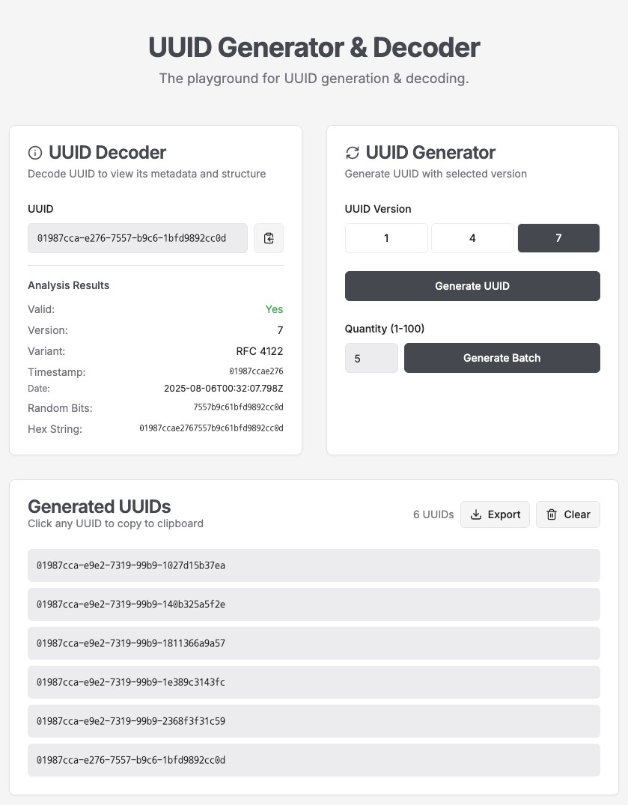

# UUID Playground (developed with Gemini CLI)

[![DeepWiki](https://img.shields.io/badge/DeepWiki-F88%2Fuuid--playground-blue.svg?logo=data:image/png;base64,iVBORw0KGgoAAAANSUhEUgAAACwAAAAyCAYAAAAnWDnqAAAAAXNSR0IArs4c6QAAA05JREFUaEPtmUtyEzEQhtWTQyQLHNak2AB7ZnyXZMEjXMGeK/AIi+QuHrMnbChYY7MIh8g01fJoopFb0uhhEqqcbWTp06/uv1saEDv4O3n3dV60RfP947Mm9/SQc0ICFQgzfc4CYZoTPAswgSJCCUJUnAAoRHOAUOcATwbmVLWdGoH//PB8mnKqScAhsD0kYP3j/Yt5LPQe2KvcXmGvRHcDnpxfL2zOYJ1mFwrryWTz0advv1Ut4CJgf5uhDuDj5eUcAUoahrdY/56ebRWeraTjMt/00Sh3UDtjgHtQNHwcRGOC98BJEAEymycmYcWwOprTgcB6VZ5JK5TAJ+fXGLBm3FDAmn6oPPjR4rKCAoJCal2eAiQp2x0vxTPB3ALO2CRkwmDy5WohzBDwSEFKRwPbknEggCPB/imwrycgxX2NzoMCHhPkDwqYMr9tRcP5qNrMZHkVnOjRMWwLCcr8ohBVb1OMjxLwGCvjTikrsBOiA6fNyCrm8V1rP93iVPpwaE+gO0SsWmPiXB+jikdf6SizrT5qKasx5j8ABbHpFTx+vFXp9EnYQmLx02h1QTTrl6eDqxLnGjporxl3NL3agEvXdT0WmEost648sQOYAeJS9Q7bfUVoMGnjo4AZdUMQku50McDcMWcBPvr0SzbTAFDfvJqwLzgxwATnCgnp4wDl6Aa+Ax283gghmj+vj7feE2KBBRMW3FzOpLOADl0Isb5587h/U4gGvkt5v60Z1VLG8BhYjbzRwyQZemwAd6cCR5/XFWLYZRIMpX39AR0tjaGGiGzLVyhse5C9RKC6ai42ppWPKiBagOvaYk8lO7DajerabOZP46Lby5wKjw1HCRx7p9sVMOWGzb/vA1hwiWc6jm3MvQDTogQkiqIhJV0nBQBTU+3okKCFDy9WwferkHjtxib7t3xIUQtHxnIwtx4mpg26/HfwVNVDb4oI9RHmx5WGelRVlrtiw43zboCLaxv46AZeB3IlTkwouebTr1y2NjSpHz68WNFjHvupy3q8TFn3Hos2IAk4Ju5dCo8B3wP7VPr/FGaKiG+T+v+TQqIrOqMTL1VdWV1DdmcbO8KXBz6esmYWYKPwDL5b5FA1a0hwapHiom0r/cKaoqr+27/XcrS5UwSMbQAAAABJRU5ErkJggg==)](https://deepwiki.com/F88/uuid-playground)
<!-- DeepWiki badge generated by https://deepwiki.ryoppippi.com/ -->

## Application Overview

UUID Playground is a web application for generating, validating, and visualizing UUIDs (Universally Unique Identifiers). It allows you to easily generate various versions of UUIDs, inspect their structure, and check their validity. This tool is designed for developers and engineers to understand how UUIDs work and to learn interactively by experimenting with them.

UUID Playgroundは、UUID（Universally Unique Identifier）を生成、検証、視覚化するためのウェブアプリケーションです。UUIDの様々なバージョンを簡単に生成し、その構造を検査し、有効性を確認できます。このツールは、開発者やエンジニアがUUIDの仕組みを理解し、実際に実験しながらインタラクティブに学習できるように設計されています。

## Development with Gemini

This project utilizes the Gemini CLI for development assistance. The following files provide context and instructions for the AI.

### Gemini Configuration

- **`x-files/GEMINI.md`**: Contains project-specific instructions for Gemini, including specifying the filenames for other context files.

### Context Files

The following files in the `x-files/` directory provide essential context for development:

- **`REQUIREMENTS.MD`**: Detailed system requirements specification.
- **`DESIGN.MD`**: System design, including UI/UX, color palette, and typography.
- **`TECH_STACK.MD`**: A list of technologies, libraries, and frameworks used in the project.
